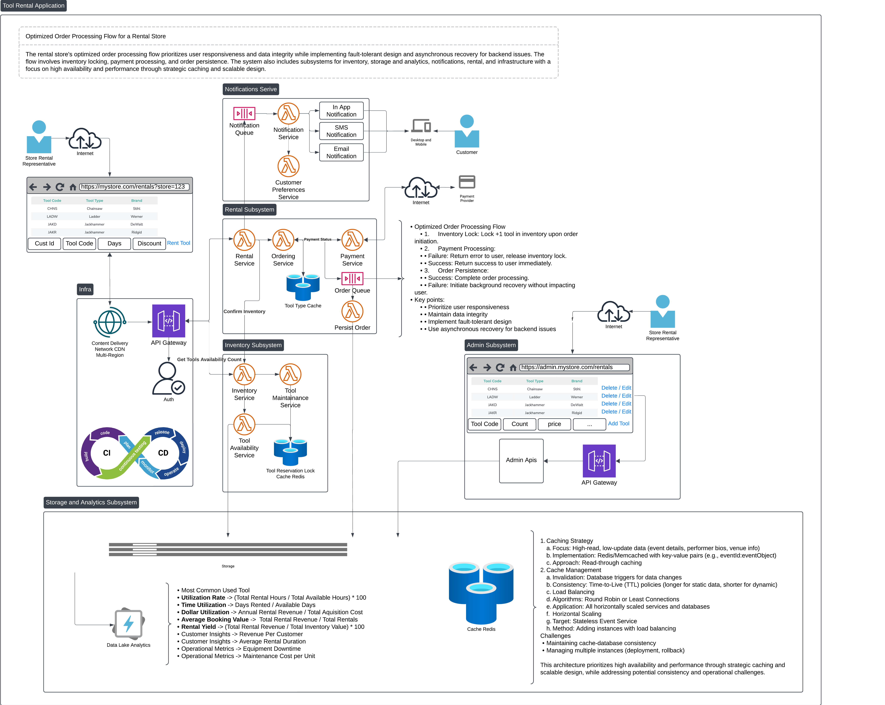

# Tool Rental Application

## Overview

The Tool Rental Application is a Java-based system designed to manage tool rentals for hardware stores. Built with scalability in mind, this foundational system can evolve into a large-scale, globally distributed application capable of meeting enterprise-level requirements such as high availability, scalability, monitoring, and continuous deployment.

## Key Features

The application offers core functionality essential for a modern rental business:

- **Tool Management**: Efficiently handles various tool types and brands.
- **Rental Fee Calculation**: Computes charges based on rental type, duration, and applicable adjustments.
- **Discount Application**: Applies discounts according to user-defined criteria.
- **Rental Agreements**: Generates comprehensive rental agreements for customers.

## Running the Application
To run the application using Maven:

```bash
kill -9 $(lsof -t -i:8080)
mvn clean package -U
mvn spring-boot:run -X
```

### Sample Checkout Request
Use the following curl command to test the checkout endpoint:

```bash
curl -X POST http://localhost:8080/api/v1/rentals/tools/checkout \
-H "Content-Type: application/json" \
-d '{"toolCode": "LADW", "rentalDays": 3, "discount": 10, "checkoutDate": "2024-12-04"}'
```

## Command Line Execution
To run the application with command line arguments:

```bash
kill -9 $(lsof -t -i:8080)
mvn clean package -U
mvn spring-boot:run -Dspring-boot.run.arguments="LADW 3 10 12/4/2024"
```

## Server Configuration
The application runs on port 8080 by default. To release the port if it's in use:

```bash
kill -9 $(lsof -t -i:8080)
```

## API Endpoints
- `POST /api/v1/rentals/tools/checkout`: Initiates a tool rental checkout process.

### Sample Request and Response
**Request:**
```json
{
  "toolCode": "LADW",
  "rentalDays": 3,
  "discount": 10,
  "checkoutDate": "12/4/2024"
}
```

**Response:**
```json
{
  "rentalAgreement": {
    "toolCode": "LADW",
    "toolType": "Ladder",
    "toolBrand": "Werner",
    "rentalDays": 3,
    "checkoutDate": "12/4/2024",
    "dueDate": "12/7/2024",
    "dailyRentalCharge": "$1.99",
    "chargeDays": 2,
    "preDiscountCharge": "$3.98",
    "discountPercentage": 10,
    "discountAmount": "$0.40",
    "finalCharge": "$3.58"
  }
}
```

## Running Tests
Execute tests using Maven:
- Modify test cases in `src/test/java/com/lyubich/toolrental/service/CheckoutServiceTest.java` as needed.

```bash
mvn test
```

## Vision for Expansion

The application is designed with scalability and extensibility in mind, making it suitable for transformation into a
multi-store, multi-region, enterprise-level system. Key future capabilities include:

### Core System Enhancements

- **Database Integration**: Transition to a persistent database layer, such as MySQL for relational data or MongoDB for
  NoSQL requirements.
- **Compliance**: Ensure adherence to GDPR and other data protection regulations.
- **Authentication and Authorization**: Implement role-based access control for enhanced security.
- **Inventory Management**: Develop a robust system to track real-time item availability across categories.
- **User Management**: Create admin interfaces for managing items, inventory, and users, as well as customer interfaces
  for managing rentals and reservations.

### Advanced Features

- **Multi-Store Support**: Expand to accommodate multiple hardware store locations.
- **Multi-Item Checkout**: Enable customers to rent multiple items, such as tools and vehicles, in a single transaction.
- **Reservation System**: Allow customers to reserve items in advance and provide the ability to cancel reservations
  when needed.
- **In-App Payments**: Integrate secure payment gateways for seamless online transactions.
- **Mobile App**: Develop a mobile application to provide customers with a convenient, on-the-go rental experience.
- **Web App**: Create a responsive and user-friendly web application for desktop and browser-based interactions.
- **Notifications**: Implement alerts and notifications for due dates, promotions, and system events.
- **Reporting and Analytics**: Provide dashboards and reports on item rentals and customer activities.

### Enterprise-Grade Systems

- **Scalability**: Transition to a microservices architecture to handle increasing load and distributed operations.
- **Monitoring and Logging**: Integrate centralized logging and monitoring systems to ensure reliability and
  performance.
- **Continuous Integration/Continuous Deployment (CI/CD)**: Automate the build, testing, and deployment pipeline for
  seamless updates.
- **Global Scaling**: Leverage cloud-native technologies, load balancers, and caching solutions to support global
  operations.
- **Asynchronous Processing**: Incorporate message queue systems for managing background tasks efficiently.
- **Security**: Fortify the application against modern threats with comprehensive security mechanisms.

## Technical Design and Architecture

This application follows a layered architecture, providing separation of concerns and a clear pathway for enhancements.
Built using the **Spring Boot framework**, it ensures flexibility and maintainability.

### Core Components

- **`controller`**: Handles HTTP requests and API routing.
- **`model`**: Represents core business entities and their relationships.
- **`service`**: Encapsulates business logic and workflow orchestration.
- **`repository`**: Manages data persistence and retrieval.
- **`exception`**: Defines custom exceptions for error handling.
- **`dto`**: Facilitates data exchange between the API and domain layers.

### High-Level Design (HLD)

The high-level design captures the system’s architecture and its interactions:


### Low-Level Design (LLD)

The low-level design dives deeper into specific components and their relationships:


### Future Architecture

For future scalability and extensibility, the application can evolve into a microservices-based architecture:


## Why This System Matters

This system is more than just a tool rental application—it’s the foundation for a scalable, resilient platform that can
grow alongside the business. By addressing the core needs today, we’ve built a launchpad for a future-proof solution
that can support a global customer base with enterprise-grade reliability, performance, and security.

With thoughtful enhancements, this application can evolve into a world-class rental system, capable of driving business
growth and operational excellence across diverse rental categories.
