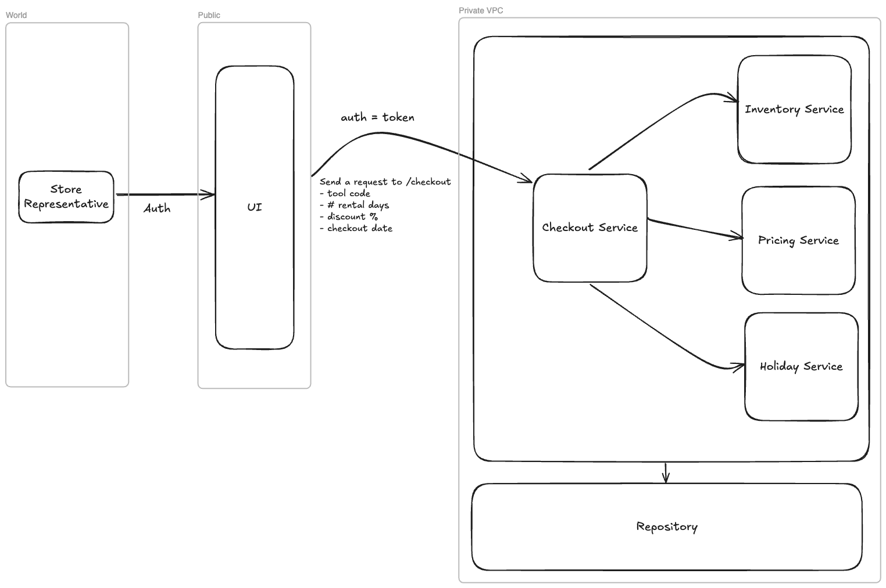
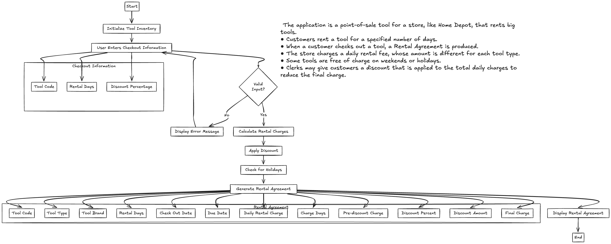

# **Tool Rental Application**

## Overview
The **Tool Rental Application** is a foundational Java-based system designed to manage tool rentals for a hardware store. While it serves as a basic starting point, the architecture and design principles ensure the system is extendable and capable of evolving into a large-scale, globally distributed application. With future enhancements, it can support enterprise-level requirements such as high availability, scalability, monitoring, and continuous deployment to meet the demands of a modern rental business.

## Key Features
This initial implementation focuses on core functionality:
- **Tool Management**: Handles different tool types and brands.
- **Rental Fee Calculation**: Calculates rental charges based on **rental type**, **rental duration**, and **applicable adjustments** (e.g., holidays, weekends).
- **Multi-Category Rentals**: Supports rentals for other items beyond tools, such as cars, trucks, or other equipment.
- **Reservation Management**: Allows customers to create and cancel reservations seamlessly.
- **Discount Application**: Applies discounts based on user-defined criteria.
- **Rental Agreements**: Generates detailed rental agreements for customers.

These features establish the groundwork for future growth, allowing the application to scale and adapt to emerging business needs.

## Vision for Expansion
The application is designed with scalability and extensibility in mind, making it suitable for transformation into a multi-store, multi-region, enterprise-level system. Key future capabilities include:

### Core System Enhancements
- **Database Integration**: Transition to a persistent database layer, such as MySQL for relational data or MongoDB for NoSQL requirements.
- **Compliance**: Ensure adherence to GDPR and other data protection regulations.
- **Authentication and Authorization**: Implement role-based access control for enhanced security.
- **Inventory Management**: Develop a robust system to track real-time item availability across categories.
- **User Management**: Create admin interfaces for managing items, inventory, and users, as well as customer interfaces for managing rentals and reservations.

### Advanced Features
- **Multi-Store Support**: Expand to accommodate multiple hardware store locations.
- **Multi-Item Checkout**: Enable customers to rent multiple items, such as tools and vehicles, in a single transaction.
- **Reservation System**: Allow customers to reserve items in advance and provide the ability to cancel reservations when needed.
- **In-App Payments**: Integrate secure payment gateways for seamless online transactions.
- **Mobile App**: Develop a mobile application to provide customers with a convenient, on-the-go rental experience.
- **Web App**: Create a responsive and user-friendly web application for desktop and browser-based interactions.
- **Notifications**: Implement alerts and notifications for due dates, promotions, and system events.
- **Reporting and Analytics**: Provide dashboards and reports on item rentals and customer activities.

### Enterprise-Grade Systems
- **Scalability**: Transition to a microservices architecture to handle increasing load and distributed operations.
- **Monitoring and Logging**: Integrate centralized logging and monitoring systems to ensure reliability and performance.
- **Continuous Integration/Continuous Deployment (CI/CD)**: Automate the build, testing, and deployment pipeline for seamless updates.
- **Global Scaling**: Leverage cloud-native technologies, load balancers, and caching solutions to support global operations.
- **Asynchronous Processing**: Incorporate message queue systems for managing background tasks efficiently.
- **Security**: Fortify the application against modern threats with comprehensive security mechanisms.

## Technical Design and Architecture
This application follows a layered architecture, providing separation of concerns and a clear pathway for enhancements. Built using the **Spring Boot framework**, it ensures flexibility and maintainability.

### Core Components
- **`controller`**: Handles HTTP requests and API routing.
- **`model`**: Represents core business entities and their relationships.
- **`service`**: Encapsulates business logic and workflow orchestration.
- **`repository`**: Manages data persistence and retrieval.
- **`exception`**: Defines custom exceptions for error handling.
- **`dto`**: Facilitates data exchange between the API and domain layers.

### High-Level Design (HLD)
The high-level design captures the system’s architecture and its interactions:

### Low-Level Design (LLD)
The low-level design dives deeper into specific components and their relationships:

## Why This System Matters
This system is more than just a tool rental application—it’s the foundation for a scalable, resilient platform that can grow alongside the business. By addressing the core needs today, we’ve built a launchpad for a future-proof solution that can support a global customer base with enterprise-grade reliability, performance, and security.

With thoughtful enhancements, this application can evolve into a world-class rental system, capable of driving business growth and operational excellence across diverse rental categories.
